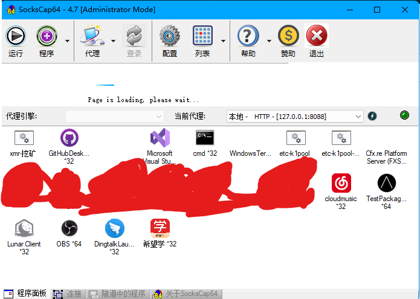
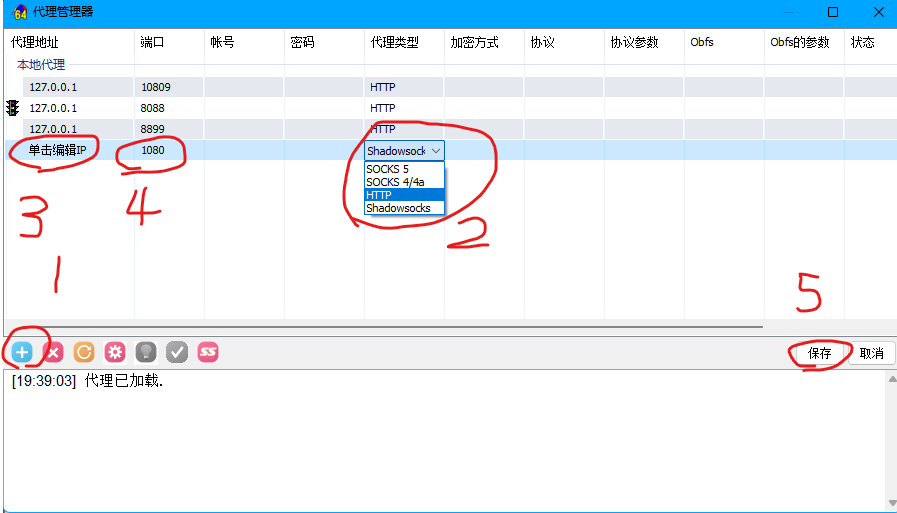
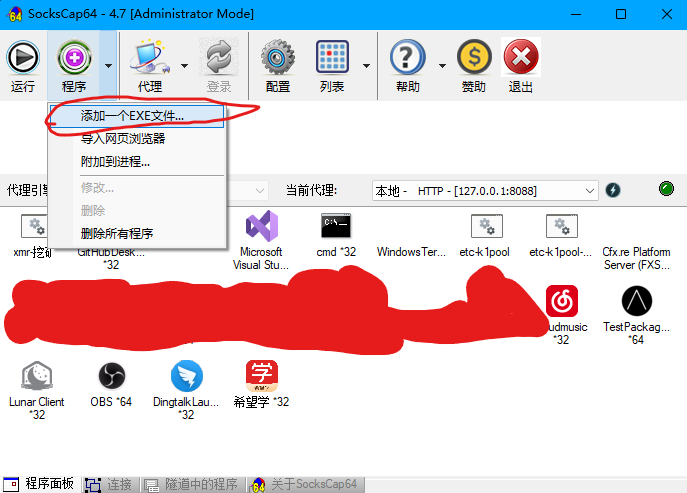
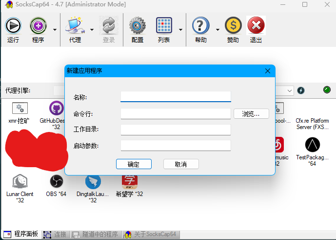
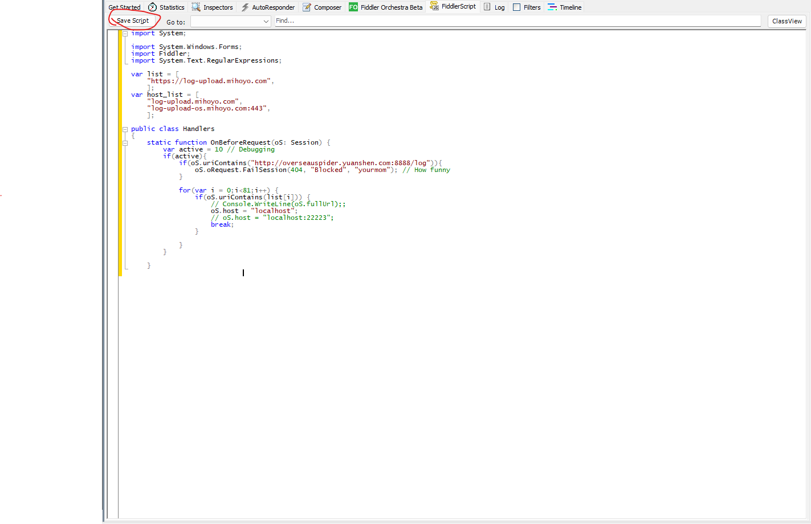

# MHYLauncherDataShield
## 屏蔽某垃圾游戏厂商对你的数据收集（仅使用于Launcher）
### 使用前准备
- Fiddler Classic最新版
- Windows 10 1803 / Windows 11系统，Windows 7与Windows 8 系统不确定可用
- 一个有编程基础的大脑

### First: SocksCap64的使用
> 由于此垃圾厂商的Launcher使用C++ QT编写，HTTP通讯的方式都很底层，甚至不走代理，导致fiddler无法抓包，更别提进行重定向等操作了。但有了SocksCap64，这一切就变得简单起来了。SocksCap64会让程序在自身创建的隧道中运行，并强制要求程序走你指定的代理，也就相当于把“走代理”这三个字刻在程序的DNA里，程序也自然不得不走代理了，fiddler也能成功抓包并进行重定向操作了。

> 那么问题来了，这么好的东西，该如何使用呢？

先Clone这个仓库，有一个SocksCap64文件夹，里面包含SocksCap64的程序文件。由于我们伟大的中国，此程序作者已不再对其进行维护了，也关闭了下载通道，换句话说，你没法从官方渠道下载此程序了。在SocksCap64文件夹中，我们能找到一个叫做`SocksCap64_RunAsAdmin.exe`的文件，右键它，以管理员身份运行，然后便能进入程序主界面了：

我们点击程序主界面上方的“代理”，就会出现“代理管理器”：

按上图步骤操作，ip一般为127.0.0.1，端口为你的fiddler classic端口，默认8888，如果您修改过，请填写您修改后的端口号，并一定要将代理类型改为HTTP！修改完毕后，记得右键你新建的代理，点击**设为活动代理**，红绿灯图标出现在代理的左侧时，则代表成功，记得一定要点保存，点保存！！！

此步骤完成后，回到SocksCap64主界面，按下图步骤操作：

然后选择垃圾厂商的Launcher的exe并保存即可，保存后双击图标即可运行

### Sec：Fiddler Classic
如果你已按上述操作完成并已在从SocksCap64中打开Launcher之前就开启了Fiddler Classic，您将会看到fiddler成功抓到了包

然后，我们需要对其进行屏蔽，这里我们需要用到fiddler script

将[此](fiddlerscript.cs)script放到你的fiddler classic中，并点击左上角的Save Script：

然后就大功告成辣！